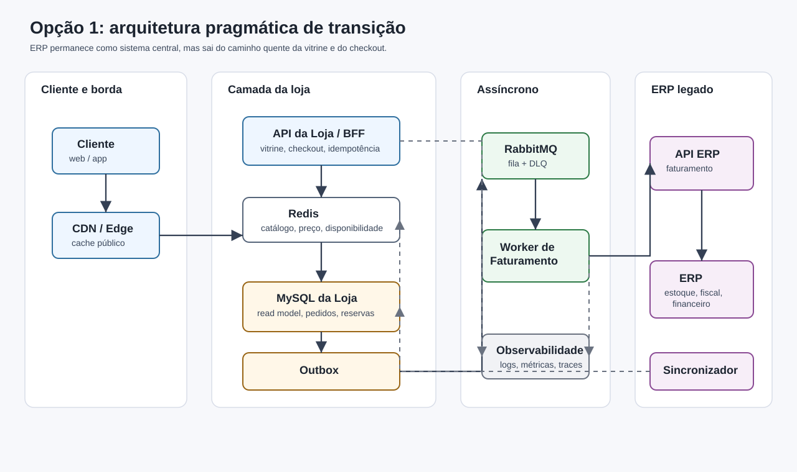
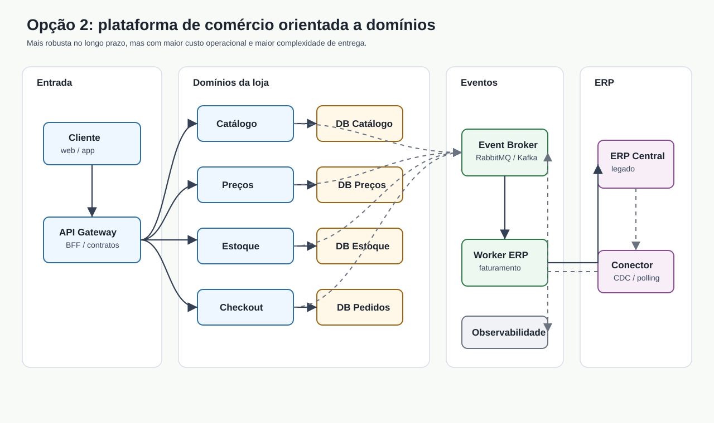
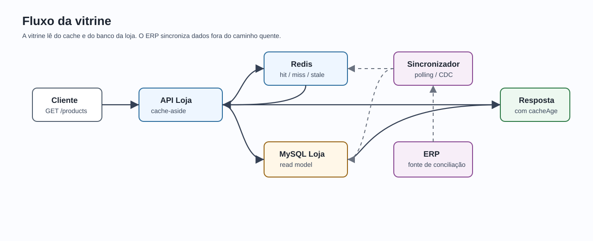
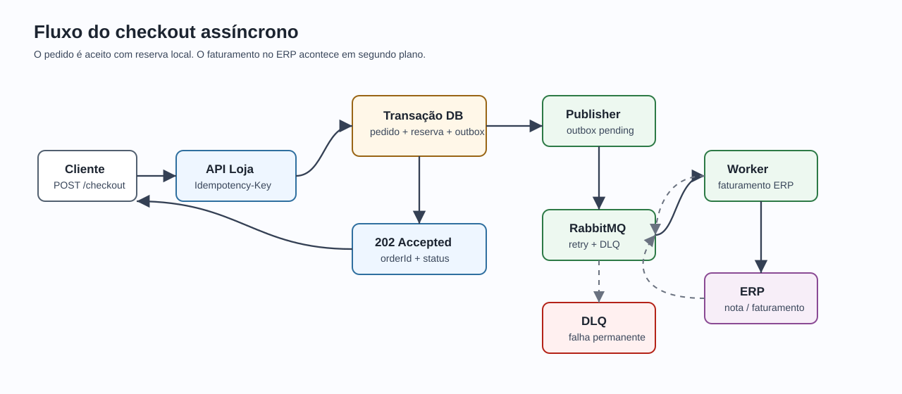
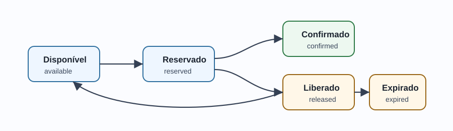

# Parte 1A - Respostas conceituais CaseCellShop

## Visão geral

Na minha visão, os três problemas têm a mesma origem: a loja virtual está acoplada de forma síncrona ao ERP. O ERP é o coração da empresa, porque concentra estoque, faturamento, financeiro e contabilidade, mas ele passou a ser usado também como backend online da vitrine e do checkout. Com o crescimento do tráfego, esse desenho começou a cobrar a conta.

O que eu proporia não é sair quebrando tudo em microserviços de imediato. Eu começaria separando responsabilidades e criando uma camada própria da loja, com banco próprio, cache, fila, workers, idempotência, reserva de estoque e observabilidade. Essa solução pode ser feita com serviços distribuídos ou até com um monólito modular bem organizado. O mais importante, neste momento, é reduzir o acoplamento com o ERP e colocar as garantias certas nos pontos críticos.

Também faço uma ressalva sobre cache: ele é fundamental para melhorar a vitrine, mas não deve ser a fonte de verdade no checkout. Para impedir overselling, a decisão de compra precisa passar por uma operação transacional de reserva de estoque.

## Arquitetura recomendada para 30 a 90 dias



Essa é a arquitetura que eu defenderia como primeira evolução. Ela resolve os principais riscos sem exigir uma reescrita completa do ERP.

O ERP continua sendo o sistema central para faturamento e conciliação, mas a loja passa a ter autonomia para leitura de catálogo, preços, disponibilidade exibida e controle do pedido. A vitrine lê de cache e de um banco próprio da loja. O checkout cria o pedido, reserva o estoque de forma atômica, grava um evento em outbox e deixa o faturamento acontecer de forma assíncrona por um worker.

### Principais componentes

| Componente | Responsabilidade |
|---|---|
| API da Loja / BFF | Atende vitrine e checkout, aplica validações, idempotência e orquestra o fluxo inicial. |
| Redis | Cache distribuído para catálogo, preços e disponibilidade exibida. |
| MySQL da Loja | Read model da loja, pedidos, reservas, idempotência, outbox e histórico de status. |
| Sincronizador ERP -> Loja | Atualiza a base da loja a partir do ERP e invalida caches afetados. |
| RabbitMQ | Fila para processamento assíncrono do faturamento e retries. |
| Worker de Faturamento | Consome pedidos pendentes, chama o ERP, atualiza status e envia falhas para DLQ quando necessário. |
| Observabilidade | Logs estruturados, métricas, traces, alertas e runbooks. |

### Trade-offs

| Critério | Avaliação |
|---|---|
| Custo | Médio-baixo. Reaproveita MySQL e adiciona Redis, RabbitMQ e workers. |
| Complexidade | Moderada. Exige cuidado com idempotência, outbox, reserva e reconciliação. |
| Latência | Boa para vitrine e para o aceite inicial do checkout. |
| Consistência | Forte na reserva local de estoque; eventual entre loja e ERP. |
| Operação | Controlável, desde que observabilidade e runbooks sejam tratados como parte da solução. |
| Aderência ao prazo | Alta para uma evolução de 30 a 90 dias. |

### Infraestrutura

Eu vejo essa arquitetura como uma boa candidata para um cenário híbrido. O ERP pode continuar no datacenter próprio, enquanto os componentes elásticos da loja podem ir para cloud ou para uma plataforma interna conteinerizada.

Se a empresa já tiver maturidade em cloud, eu priorizaria serviços gerenciados para Redis, fila, banco da loja, logs e métricas. Isso reduz carga operacional. Se ainda não houver essa maturidade, dá para começar on-premise com Docker, Kubernetes ou VMs, aceitando menor elasticidade.

## Segunda opção: plataforma de comércio orientada a domínios



Essa seria uma alternativa mais robusta para longo prazo. Nela, catálogo, preços, estoque e checkout passam a ser domínios independentes, cada um com seu banco e seus contratos. O ERP continua integrado, mas deixa de ser o centro operacional da experiência digital.

Eu não começaria por essa opção se a equipe for pequena ou se o prazo for curto, porque o custo operacional cresce bastante. Ela é uma boa direção evolutiva, mas não necessariamente o primeiro passo.

### Trade-offs

| Critério | Avaliação |
|---|---|
| Custo | Alto. Mais serviços, bancos, pipelines, contratos e observabilidade. |
| Complexidade | Alta. Exige maturidade em deploy, versionamento, operação e governança. |
| Latência | Excelente para leitura, desde que os read models estejam bem desenhados. |
| Consistência | Boa se o domínio de estoque for bem isolado, mas ainda haverá consistência eventual com o ERP. |
| Operação | Mais difícil. Há mais pontos de falha e mais necessidade de automação. |
| Aderência ao prazo | Média-baixa para 30 a 90 dias. Melhor como visão de evolução. |

### RabbitMQ ou Kafka

Para este caso, eu começaria com RabbitMQ. O problema principal é fila de trabalho: faturar pedidos, aplicar retry, controlar DLQ e processar comandos assíncronos. Kafka faria mais sentido se a empresa precisasse de um log de eventos com replay, múltiplos consumidores analíticos e processamento de streams em larga escala.

Independentemente da ferramenta, eu assumiria que mensagens podem ser duplicadas. A proteção real vem de consumidores idempotentes, chave de evento, controle de status e outbox transacional.

## Pergunta 1 - Diagnóstico, trade-offs e arquitetura alvo

### 01 | Performance da vitrine

Eu acredito que a causa raiz seja o uso do ERP como dependência online da vitrine. A loja consulta o ERP a cada acesso, então um fluxo de leitura massiva fica preso a um sistema transacional que provavelmente foi desenhado para rotinas internas de backoffice.

Para o cliente, isso aparece como página lenta, abandono de navegação e pior experiência de compra. Para o negócio, significa perda de conversão, maior custo por acesso e risco em campanhas. Para a operação, o ERP vira gargalo e fica difícil saber se a lentidão está na loja, no banco, na rede ou no próprio ERP.

Eu compararia três caminhos:

| Caminho | Pontos positivos | Pontos negativos |
|---|---|---|
| Cache simples na API | É rápido de implementar e reduz chamadas repetidas ao ERP. | Pode entregar dado obsoleto e não resolve bem invalidação. |
| Banco próprio da loja + cache distribuído | Dá autonomia para a loja, reduz latência e tira o ERP do caminho quente. | Exige sincronização, métrica de atraso e reconciliação. |
| Serviços independentes de catálogo, preço e estoque | Escala melhor no longo prazo. | É mais caro, mais complexo e pode ser prematuro. |

Minha escolha para 30 a 90 dias seria banco próprio da loja com Redis e sincronização controlada com o ERP. A disponibilidade exibida na vitrine pode ter pequena defasagem controlada, mas o checkout precisa validar por reserva transacional.

### 02 | Consistência de estoque

Nesse ponto, a causa raiz é uma condição de corrida. Uma checagem simples de estoque não basta, porque duas compras podem ler o mesmo saldo disponível ao mesmo tempo e ambas tentarem confirmar a venda.

O impacto para o cliente é grave: compra cancelada, reembolso, atraso e perda de confiança. Para o negócio, há custo operacional, atendimento manual, risco de chargeback e dano de reputação. Para a operação, surgem divergências entre pedido, estoque e ERP.

Eu avaliaria estes caminhos:

| Caminho | Pontos positivos | Pontos negativos |
|---|---|---|
| Consultar estoque em tempo real no ERP | Parece simples e usa a fonte atual. | Continua lento e não impede corrida sem operação atômica. |
| Lock pessimista | Garante consistência em SKUs muito concorridos. | Pode reduzir throughput e aumentar deadlocks/timeouts. |
| Reserva de estoque com update atômico | Bom equilíbrio entre consistência, custo e simplicidade. | Exige expiração de reserva e reconciliação. |
| Lock distribuído | Pode ajudar em casos específicos. | É mais frágil operacionalmente e não substitui transação no banco. |

Minha recomendação é fazer reserva de estoque no banco da loja com update condicional dentro de uma transação:

```sql
UPDATE inventory
SET available = available - :qty,
    reserved = reserved + :qty
WHERE sku = :sku
  AND available >= :qty;
```

Se `affected_rows = 1`, a reserva foi feita. Se for `0`, não há estoque suficiente. Essa operação deve acontecer na mesma transação que cria o pedido e registra a chave de idempotência.

### 03 | Resiliência do checkout

Aqui, a causa raiz é colocar o faturamento do ERP dentro da jornada síncrona do cliente. Quando a API do ERP demora ou dá timeout, o sistema fica em um estado ambíguo: não sabemos se o ERP recebeu, processou ou falhou.

Para o cliente, isso vira tela travada, erro após tentar comprar ou pedido duplicado em retry. Para o negócio, pode virar pedido perdido, duplicado ou divergente fiscalmente. Para a operação, o problema é ainda pior quando não existe rastreabilidade ponta a ponta.

Eu compararia estes caminhos:

| Caminho | Pontos positivos | Pontos negativos |
|---|---|---|
| Aumentar timeout | É simples. | Só mascara o problema e piora a experiência em falhas. |
| Retry síncrono | Recupera algumas falhas transientes. | Aumenta latência e pode duplicar pedido sem idempotência. |
| Checkout assíncrono com outbox e worker | Dá resiliência, rastreabilidade e controle de retry. | Exige status de pedido, fila, DLQ e reconciliação. |

Minha escolha seria retornar `202 Accepted` no `POST /checkout`, com `orderId` e status inicial. O faturamento no ERP aconteceria em segundo plano, por worker idempotente. O cliente acompanharia o status pelo endpoint `GET /orders/{orderId}/status`.

## Fluxos principais da arquitetura recomendada

### Fluxo da vitrine



Na vitrine, a API tenta ler primeiro do Redis. Se houver cache hit, responde rapidamente. Se houver cache miss, busca no banco da loja, popula o cache com TTL e jitter, e responde. O sincronizador mantém a base da loja atualizada a partir do ERP e invalida as chaves afetadas.

### Fluxo do checkout



No checkout, a API valida a chave de idempotência, cria o pedido, reserva o estoque e grava o evento na outbox dentro da mesma transação. Depois, um publisher publica o evento no RabbitMQ, e o worker tenta faturar no ERP. Em caso de erro transiente, aplica retry com backoff. Em caso de erro permanente, envia para DLQ e mantém rastreabilidade.

## Pergunta 2 - Cache, invalidação e performance da vitrine

Eu colocaria cache em camadas, cada uma com uma responsabilidade clara.

| Camada | Papel |
|---|---|
| CDN / Edge | Reduz latência de assets e respostas públicas de catálogo quando possível. |
| Cache local curto | Evita chamadas repetidas ao Redis para chaves muito quentes, com TTL de poucos segundos. |
| Redis | Cache principal de produtos, preços e disponibilidade exibida. |
| Banco da loja | Read model persistente para leitura quando o cache falha ou expira. |
| ERP | Fonte de conciliação e sincronização, não dependência online da vitrine. |

Para catálogo, eu usaria TTL maior, algo como 5 a 30 minutos, porque muda menos. Para preço, TTL menor, como 30 a 120 segundos, ou invalidação imediata quando o sincronizador detectar alteração. Para disponibilidade exibida, TTL bem curto, como 5 a 15 segundos. Mesmo assim, reforço: a disponibilidade exibida é informativa; a decisão real acontece na reserva do checkout.

Eu usaria cache-aside como base: a API busca no Redis, e se não encontrar, busca no banco da loja e popula o cache. Para itens muito acessados, usaria refresh-ahead. Para evitar cache stampede, eu aplicaria TTL com jitter, single-flight por chave, stale-while-revalidate e limite de concorrência para recomputação.

Também teria fallback. Se o Redis cair, a API lê do banco da loja. Se a sincronização com o ERP atrasar demais, o sistema pode degradar a exibição de alguns SKUs, por exemplo mostrando baixa disponibilidade ou indisponibilidade temporária em itens sensíveis.

### Métricas para validar o cache

| Objetivo | Métricas |
|---|---|
| Performance | p50, p95 e p99 de `GET /products`, tempo de Redis, tempo de banco e taxa de timeout. |
| Custo | Chamadas evitadas ao ERP, chamadas evitadas ao banco e uso de CPU/memória. |
| Qualidade do cache | Hit ratio, miss ratio, evictions, erros no Redis e contagem de stampede. |
| Frescor | `cache_age_seconds`, `erp_sync_lag_seconds`, respostas stale e divergência loja vs ERP por SKU. |
| Negócio | Conversão, abandono de vitrine e pedidos rejeitados por falta de estoque após exibição como disponível. |

## Pergunta 3 - Observabilidade, Datadog ou equivalente

Eu instrumentaria a solução desde o início, porque sem observabilidade uma arquitetura assíncrona vira uma caixa-preta distribuída.

### Logs estruturados

Campos que eu tornaria obrigatórios:

- `timestamp`
- `level`
- `service`
- `env`
- `version`
- `correlationId`
- `requestId`
- `traceId`
- `spanId`
- `customerId`, quando existir
- `orderId`, quando existir
- `sku`, quando existir
- `idempotencyKey`, no checkout
- `operation`
- `status`
- `durationMs`
- `errorCode`
- `retryCount`
- `cacheHit`
- `cacheKey`
- `messageId`

Eventos que eu registraria:

- cache hit, miss e stale;
- sincronização com ERP iniciada, finalizada ou com falha;
- divergência detectada entre loja e ERP;
- pedido criado;
- reserva criada, confirmada, expirada ou cancelada;
- evento publicado pela outbox;
- retry de faturamento;
- envio para DLQ;
- reconciliação manual ou automática.

### Métricas

Counters:

- `products_requests_total`
- `cache_hits_total`
- `cache_misses_total`
- `checkout_requests_total`
- `orders_created_total`
- `stock_reservations_total`
- `stock_reservation_rejected_total`
- `outbox_published_total`
- `erp_billing_success_total`
- `erp_billing_failure_total`
- `dlq_messages_total`
- `idempotency_replays_total`

Gauges:

- `erp_sync_lag_seconds`
- `queue_depth`
- `oldest_message_age_seconds`
- `stock_available`
- `stock_reserved`
- `outbox_pending_count`
- `orders_pending_billing_count`

Histograms:

- `http_request_duration_ms`
- `cache_get_duration_ms`
- `db_query_duration_ms`
- `checkout_processing_duration_ms`
- `erp_billing_duration_ms`
- `message_processing_duration_ms`

### Traces

No `GET /products`, eu rastrearia a requisição HTTP, acesso ao cache, consulta ao banco em caso de miss e serialização da resposta.

No `POST /checkout`, eu rastrearia validação da chave de idempotência, transação no banco, reserva de estoque, criação do pedido, gravação da outbox, publicação na fila e processamento pelo worker até o ERP.

### SLI, SLO, alertas e runbooks

| SLI | SLO inicial |
|---|---|
| Disponibilidade de `GET /products` | 99,9% mensal |
| Latência p95 de `GET /products` | Menor que 200 ms com cache quente |
| Disponibilidade de `POST /checkout` | 99,5% mensal |
| Latência p95 do aceite do checkout | Menor que 500 ms |
| Pedidos faturados em até 5 minutos | 99% |
| Divergência crítica de estoque | Menor que 0,1% dos SKUs por dia |
| Mensagens em DLQ | Zero em operação normal |

Alertas que eu configuraria:

- queda brusca de cache hit ratio;
- `erp_sync_lag_seconds` acima do limite;
- p95 ou p99 da vitrine acima do SLO;
- aumento de rejeição de reserva para SKU exibido como disponível;
- fila crescendo por mais de alguns minutos;
- mensagens novas em DLQ;
- pedidos em `PENDING_BILLING` acima do tempo esperado;
- taxa de erro do ERP acima do limite.

Runbooks:

- Cache degradado: verificar Redis, hit ratio, fallback para banco e possibilidade de aumentar TTL temporariamente.
- ERP lento: manter checkout aceitando pedidos se a reserva local estiver saudável, acompanhar fila e comunicar atraso de faturamento.
- DLQ: classificar erro, corrigir causa, reprocessar mensagens idempotentes e abrir incidente se houver risco fiscal ou de estoque.
- Divergência de estoque: pausar venda de SKUs afetados, rodar reconciliação e ajustar reservas expiradas.

## Pergunta 4 - Concorrência, estoque e idempotência

Uma checagem simples de estoque é insuficiente porque existe uma janela entre ler o saldo e gravar a compra. Esse é o problema clássico de concorrência: duas requisições podem observar `available = 1` e ambas seguirem para confirmação.

Eu compararia assim:

| Abordagem | Como funciona | Vantagens | Riscos |
|---|---|---|---|
| Atomic update condicional | Atualiza o saldo somente se `available >= qty`. | Simples, rápido e transacional. | Exige controle correto de reserva e expiração. |
| Pessimistic lock | Bloqueia a linha ou SKU durante a transação. | Forte consistência. | Pode reduzir throughput em SKUs muito concorridos. |
| Reserva de estoque | Move saldo de disponível para reservado antes do faturamento. | Combina bem com checkout assíncrono. | Precisa liberar reserva em falha, abandono ou expiração. |
| Distributed lock | Usa uma ferramenta externa para coordenar concorrência. | Pode ajudar em casos específicos. | É mais complexo e não substitui transação no banco. |

Minha recomendação é reserva de estoque com update atômico no banco da loja. A reserva teria um ciclo de vida simples:



Para idempotência, eu exigiria `Idempotency-Key` no `POST /checkout`. A loja gravaria `idempotency_key`, `request_hash`, `order_id`, `status` e um snapshot da resposta. Se a mesma chave chegar de novo com o mesmo payload, retorno o mesmo pedido. Se chegar com payload diferente, retorno `409 Conflict`.

O worker também precisa ser idempotente. Se o ERP aceitar uma chave externa, eu usaria `orderId` como referência. Se não aceitar, o worker precisa registrar tentativas e consultar o estado antes de reenviar uma cobrança ou faturamento.

### Testes que eu faria

- N requisições concorrentes para 1 unidade de estoque; apenas uma deve reservar.
- Duplo clique com a mesma `Idempotency-Key`; deve retornar o mesmo pedido.
- Retry após timeout do worker; não pode faturar duas vezes.
- Expiração de reserva; o estoque deve voltar para disponível.
- Reprocessamento de mensagem; não pode duplicar pedido, reserva ou faturamento.

## Pergunta 5 - Mensageria, resiliência, contrato e IA

Eu publicaria a mensagem depois de gravar o pedido, mas não faria isso com um `publish` solto depois do commit. A forma mais segura é usar transactional outbox.

O fluxo seria:

1. Abro uma transação no banco da loja.
2. Valido a chave de idempotência.
3. Reservo o estoque com update atômico.
4. Crio o pedido.
5. Gravo um evento na tabela `outbox_events`.
6. Faço commit.
7. Um publisher lê eventos pendentes e publica no RabbitMQ.
8. Depois da confirmação de publicação, marca o evento como publicado.

Isso evita pedido fantasma, que seria uma mensagem publicada sem pedido gravado, e também evita mensagem perdida, que seria um pedido gravado sem evento para processamento. Mesmo que haja publicação duplicada, o consumidor deve ser idempotente usando `eventId` e `orderId`.

Para retry, eu usaria backoff exponencial com jitter em falhas transientes do ERP. Para falhas permanentes ou mensagens inválidas, enviaria para DLQ. Além disso, eu teria reconciliação periódica para pedidos pendentes há muito tempo, reservas expiradas e divergências entre loja e ERP.

### Contratos

Eu documentaria a API com OpenAPI, incluindo:

- `GET /products`;
- `POST /checkout`;
- `GET /orders/{orderId}/status`;
- header `Idempotency-Key`;
- schemas de sucesso e erro;
- `correlationId` nas respostas e logs.

Também documentaria os eventos principais:

- `OrderCreated`;
- `StockReserved`;
- `BillingRequested`;
- `BillingSucceeded`;
- `BillingFailed`;
- `StockReservationReleased`.

### Testes

Eu cobriria:

- regras de reserva de estoque;
- idempotência;
- status de pedido;
- cache hit e miss;
- concorrência no checkout;
- timeout do ERP;
- erro 500 do ERP;
- mensagem duplicada;
- DLQ e reprocessamento;
- contrato OpenAPI.

### Uso de IA

Eu usaria IA como apoio para gerar matriz de riscos, casos de teste, OpenAPI inicial, runbooks e revisão do texto arquitetural. Mas eu revisaria tudo contra as restrições do case: o ERP não pode ser alterado, o cache não é fonte de verdade para checkout e mensageria pode entregar mensagens duplicadas.

Também registraria os prompts relevantes em `PROMPTS.md`, explicando o que foi pedido, o que foi aproveitado e o que foi ajustado manualmente.

## Decisão final

Minha decisão seria seguir com a primeira opção: uma arquitetura pragmática de transição, com banco próprio da loja, Redis, RabbitMQ, workers, outbox, reserva de estoque, idempotência e observabilidade.

Essa abordagem resolve os problemas de negócio sem cair em dois extremos: nem confiar apenas em cache, nem propor uma arquitetura de microserviços cara demais para o primeiro ciclo. Ela dá autonomia para a loja, preserva o ERP como sistema central e cria uma base segura para evoluir depois.
