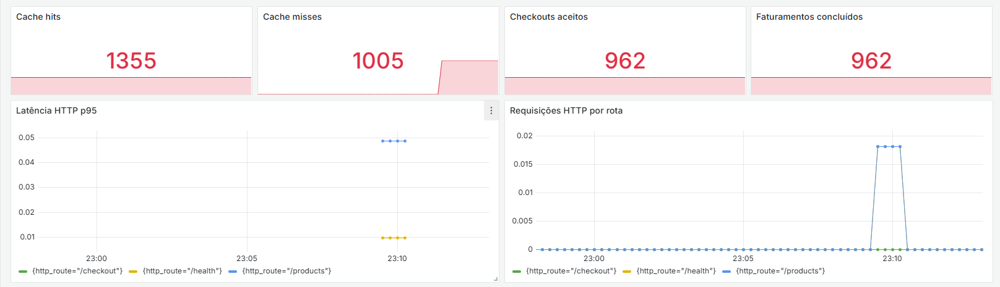
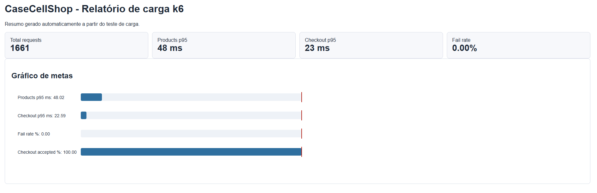

# CaseCellShop - Parte 2

API backend em C# para demonstrar cache de catálogo, checkout assíncrono, reserva transacional de estoque, idempotência, outbox, rastreabilidade e observabilidade operacional.

## Stack

- .NET 8 / ASP.NET Core Minimal APIs
- EF Core 8 + SQLite
- Redis via `IDistributedCache`
- MassTransit + EF Outbox
- OpenAPI/Swagger
- OpenTelemetry com exportação OTLP
- Prometheus + Grafana
- xUnit + FluentAssertions
- k6
- Docker / Docker Compose

## Arquitetura

A solução foi organizada em Clean Architecture com projetos separados:

```text
src/
  CaseCellShop.Domain          Entidades, contratos, eventos e interfaces
  CaseCellShop.Application     Casos de uso e regras de aplicação
  CaseCellShop.Infrastructure  EF Core, Redis, MassTransit, ERP fake e relógio
  CaseCellShop.Api             Endpoints, DI, health check e observabilidade
tests/
  CaseCellShop.Tests           Testes de aplicação e concorrência
```

A direção das dependências fica de fora para dentro: a API conhece Application e Infrastructure; Application conhece apenas Domain; Infrastructure implementa as portas definidas no Domain. Assim, Redis, EF Core, MassTransit e o ERP simulado ficam trocáveis sem contaminar a regra de negócio.

## Como rodar com Docker

```bash
docker compose up --build
```

A API e as ferramentas ficam disponíveis em:

- `http://localhost:8080/products`
- `http://localhost:8080/swagger`
- `http://localhost:8080/health`
- `http://localhost:3000` - Grafana (`admin` / `admin`)
- `http://localhost:9090` - Prometheus

Para executar o teste de carga:

```bash
docker compose --profile loadtest run --rm k6
```

Os resultados são gravados em:

- `load-tests/results/summary.json`
- `load-tests/results/summary.html`

## Como rodar localmente

Suba um Redis local:

```bash
docker run --rm -p 6379:6379 redis:7-alpine
```

Depois execute:

```bash
dotnet restore CaseCellShop.slnx
dotnet run --project src/CaseCellShop.Api/CaseCellShop.Api.csproj
```

## Endpoints

O contrato está disponível em runtime via Swagger (`/swagger`) e também como arquivo estático em `docs/openapi.yaml`.

### GET /products

Retorna catálogo com disponibilidade exibida. Usa Redis com TTL e fallback para o banco da loja.

```bash
curl http://localhost:8080/products
```

### POST /checkout

Cria pedido, reserva estoque e retorna `202 Accepted`. O faturamento no ERP é processado em segundo plano.

```bash
curl -X POST http://localhost:8080/checkout \
  -H "Content-Type: application/json" \
  -H "Idempotency-Key: pedido-001" \
  -d "{\"items\":[{\"sku\":\"CASE-IPHONE-15-BLACK\",\"quantity\":1}]}"
```

Resposta esperada:

```json
{
  "orderId": "00000000-0000-0000-0000-000000000000",
  "status": "PendingBilling"
}
```

### GET /orders/{orderId}/status

Consulta o status do pedido.

```bash
curl http://localhost:8080/orders/{orderId}/status
```

Status possíveis:

- `PendingBilling`
- `Billing`
- `Billed`
- `BillingFailed`

## Decisões e trade-offs

### Cache

O Redis acelera a vitrine, mas não é fonte de verdade para checkout. A disponibilidade exibida pode estar levemente defasada; a compra só é confirmada se a reserva transacional no banco for bem-sucedida.

### Estoque

A reserva usa `ExecuteUpdateAsync` com condição `available >= quantity`. Isso evita o padrão inseguro de ler saldo, decidir em memória e salvar depois.

### Idempotência

O header `Idempotency-Key` é obrigatório no checkout. Se a mesma chave chegar com o mesmo payload, a API retorna o mesmo pedido. Se chegar com payload diferente, retorna conflito.

### Outbox

O MassTransit EF Outbox grava o evento junto com a transação do pedido. Isso reduz o risco de pedido sem mensagem ou mensagem sem pedido. Para manter a execução local simples, o transporte configurado é in-memory; em produção, a troca natural seria RabbitMQ.

### ERP simulado

O ERP é representado por `FakeErpBillingClient`, com atraso configurável por `Erp:BillingDelayMs`.

## Testes

```bash
dotnet test CaseCellShop.slnx -m:1
```

Cobertura implementada:

- cache de catálogo;
- idempotência com mesma chave e payload;
- rejeição de mesma chave com payload diferente;
- concorrência para impedir overselling.

Resultado validado:

```text
Aprovado: 4, Com falha: 0
```

No SDK .NET 10 local, usei `-m:1` para evitar uma falha intermitente do MSBuild paralelo ao resolver projetos referenciados. Não houve erro de compilação ou de teste.

## Observabilidade

Logs estruturados cobrem:

- cache hit/miss;
- pedido criado;
- rejeição de reserva de estoque;
- faturamento iniciado;
- faturamento concluído;
- mensagem sem pedido correspondente.

Traces e métricas são emitidos via OpenTelemetry para o Collector local, com Prometheus coletando métricas e Grafana exibindo dashboard provisionado. O mesmo desenho permite integração com Datadog apontando `Observability__OtlpEndpoint` para um Datadog Agent/OTLP ou para um Collector configurado com exporter Datadog.

Dashboard local no Grafana:



Traces locais cobrem:

- `products.list`;
- `checkout.start`;
- `orders.status`;
- instrumentação ASP.NET Core;
- chamadas HTTP futuras.

## Métricas sugeridas para Datadog ou equivalente

Counters:

- `products_requests_total`
- `cache_hits_total`
- `cache_misses_total`
- `checkout_requests_total`
- `orders_created_total`
- `stock_reservation_rejected_total`
- `erp_billing_success_total`
- `erp_billing_failure_total`
- `dlq_messages_total`

Gauges:

- `queue_depth`
- `orders_pending_billing_count`
- `stock_available`
- `stock_reserved`
- `outbox_pending_count`

Histograms:

- `http_request_duration_ms`
- `cache_get_duration_ms`
- `db_query_duration_ms`
- `checkout_processing_duration_ms`
- `erp_billing_duration_ms`
- `message_processing_duration_ms`

## Teste de carga k6

O cenário em `load-tests/casecellshop.js` simula navegação de vitrine e início de checkout em paralelo.

Resultado validado no Docker:

```text
Total de requisições: 1661
Checks aprovados: 3322
Checks com falha: 0
HTTP fail rate: 0%
p95 geral: 46.09 ms
p95 GET /products: 48.02 ms
p95 POST /checkout: 22.59 ms
Checkout accepted rate: 100%
```

Relatório visual gerado pelo k6:



O arquivo `summary.html` inclui um gráfico SVG comparando p95, taxa de falha e aceite do checkout contra as metas definidas no script. Em texto, o resultado do teste confirma que a API respondeu sem falhas, manteve `0%` de erro HTTP e aceitou `100%` dos checkouts simulados durante a carga.

## SLOs e alertas

SLOs iniciais:

- `GET /products` com 99,9% de disponibilidade.
- p95 de `GET /products` menor que 200 ms com cache quente.
- `POST /checkout` com 99,5% de disponibilidade.
- p95 do aceite do checkout menor que 500 ms.
- 99% dos pedidos faturados em até 5 minutos.

Alertas:

- queda de cache hit ratio;
- crescimento de pedidos em `PendingBilling`;
- aumento de rejeição de reserva para produtos exibidos como disponíveis;
- falhas de faturamento no ERP;
- mensagens presas na outbox;
- mensagens em DLQ, quando houver transporte externo.

## Runbooks

### Redis indisponível

1. Verificar conectividade com Redis.
2. Conferir logs de `catalog_cache_miss`.
3. Confirmar se a API está respondendo pelo banco.
4. Reduzir tráfego ou aumentar réplicas se o banco ficar pressionado.

### ERP lento

1. Conferir pedidos em `PendingBilling` e `Billing`.
2. Acompanhar retries do worker.
3. Manter aceite de pedido se a reserva local estiver saudável.
4. Comunicar atraso de faturamento se o SLO for rompido.

### Suspeita de overselling

1. Consultar `stock_available` e `stock_reserved`.
2. Verificar pedidos concorrentes para o mesmo SKU.
3. Confirmar se houve falha no `ExecuteUpdateAsync` condicional.
4. Rodar conciliação entre pedidos, reservas e estoque.

## ADRs

Os ADRs estão em `docs/architectural-decision-records`:

- ADR-001 - Usar C# com ASP.NET Core Minimal APIs
- ADR-002 - Usar Redis para cache de catálogo
- ADR-003 - Usar EF Core com transação e reserva atômica de estoque
- ADR-004 - Usar MassTransit EF Outbox para checkout assíncrono
- ADR-005 - Observabilidade local com logs estruturados e OpenTelemetry
- ADR-006 - Separar projetos com Clean Architecture
- ADR-007 - Observabilidade com OpenTelemetry, Prometheus, Grafana e caminho para Datadog
- ADR-008 - Testar carga com k6 e relatório HTML

## Limitações

- SQLite foi escolhido para execução local. Em produção, eu avaliaria MySQL ou PostgreSQL.
- O ERP é simulado.
- O transporte do MassTransit é in-memory para simplificar o desafio.
- Não há autenticação, pagamento real ou frontend, porque estão fora do escopo.
- O dashboard Grafana é inicial e focado nas métricas demonstradas; em produção, eu refinaria painéis por SLO, fila, outbox, banco e ERP.
